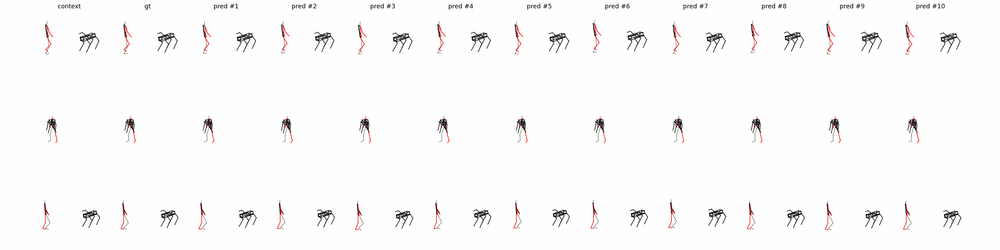
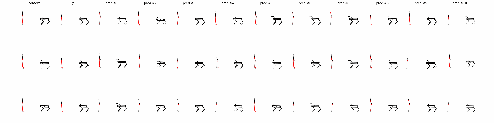
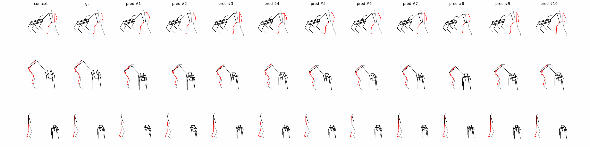

# We will release the data_loader part after the paper is accepted.


## Visualization Results 



## 🛠 Setup

### 1. Python environment

The CPU regression suite was verified on Windows with Python 3.12.14 and
PyTorch 2.14.0+cpu. The exact tested dependencies are in `requirements-test.txt`.
The old Python 3.8/PyTorch 1.7 instructions are not compatible with the current
versioned checkpoint API. `requirement.txt` is retained only as a historical list.

```bash
python -m venv .venv
# Activate the environment using the command for your shell.
python -m pip install -r requirements-test.txt
python -m pytest tests -q
```

GPU training requires a PyTorch CUDA build suitable for the target machine; the
CPU suite does not validate GPU speed, memory use, or final prediction quality.

### 2. Datasets

- [HARPER](https://intelligolabs.github.io/HARPER/)
- [CHICO](https://github.com/AlessioSam/CHICO-PoseForecasting)
- [CoMaD](https://github.com/portal-cornell/comad)
- [3DPW](https://virtualhumans.mpi-inf.mpg.de/3DPW/)
- [CMU Mocap](http://mocap.cs.cmu.edu/)

## ⏳ To Training

Training on HARPER:

python main.py --cfg harper3d_30hz --mode train --exp_name harper3d_30hz

python main.py --cfg harper3d_120hz --mode train --exp_name harper3d_120hz

Training on CHICO:

python main.py --cfg chico --mode train --exp_name chico

Training on CoMad:

python main.py --cfg comad --mode train --exp_name comad


### 🔎 To Evaluation

Evaluate on HARPER:

python main.py --cfg harper3d_30hz --mode eval --ckpt ./results/harper3d_30hz/models/best_ema.pt

python main.py --cfg harper3d_120hz --mode eval --ckpt ./results/harper3d_120hz/models/best_ema.pt

Evaluate on CHICO:

python main.py --cfg chico --mode eval --ckpt ./results/chico/models/best_ema.pt

Evaluate on CoMad:

python main.py --cfg comad --mode eval --ckpt ./results/comad/models/best_ema.pt

## 🎥 To Visualization
Run the following scripts for visualization purpose:

python main.py --cfg harper3d_30hz --mode pred --vis_row 3 --vis_col 10 --ckpt ./results/harper3d_30hz/models/best_ema.pt

python main.py --cfg harper3d_120hz --mode pred --vis_row 3 --vis_col 10 --ckpt ./results/harper3d_120hz/models/best_ema.pt

Evaluate on CHICO:

python main.py --cfg chico --mode pred --vis_row 3 --vis_col 10 --ckpt ./results/chico/models/best_ema.pt

Evaluate on CoMad:

python main.py --cfg comad --mode pred --vis_row 3 --vis_col 10 --ckpt ./results/comad/models/best_ema.pt


## 🌹 Acknowledgment
Project structure is borrowed from [TransFusion](https://github.com/sibotian96/TransFusion). We would like to thank the authors for making their code publicly available.


